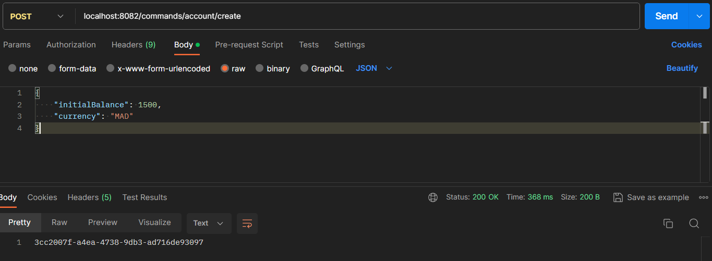
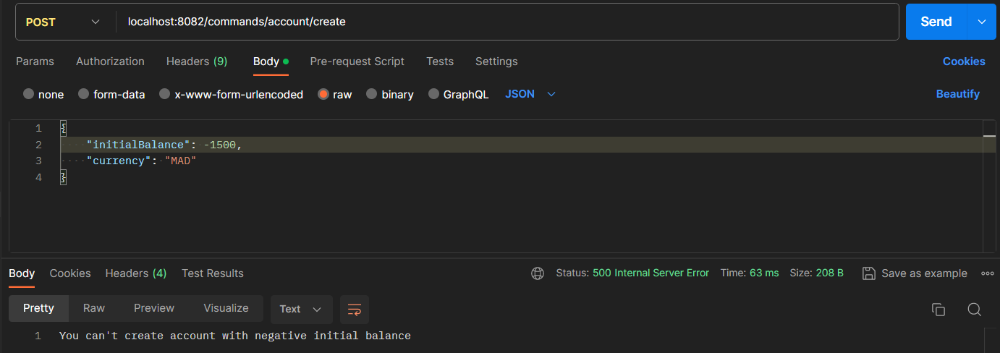
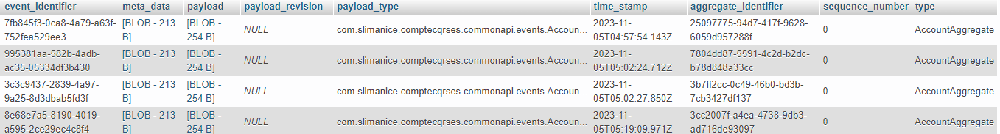
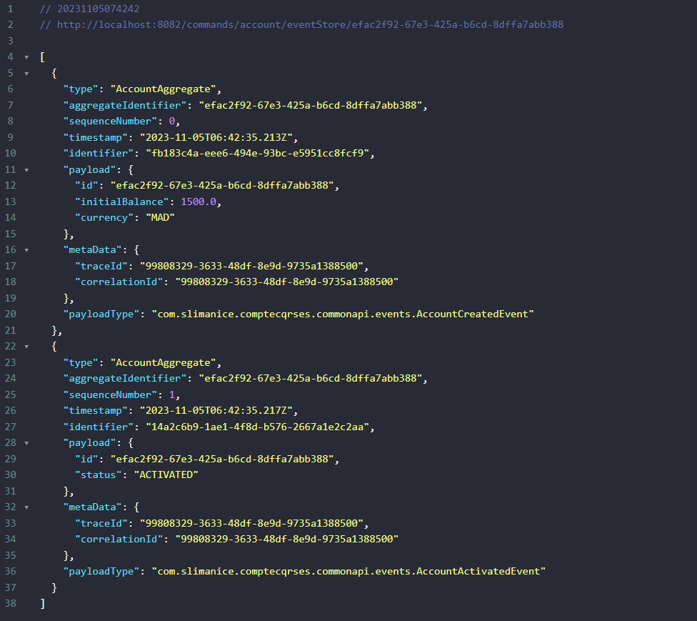
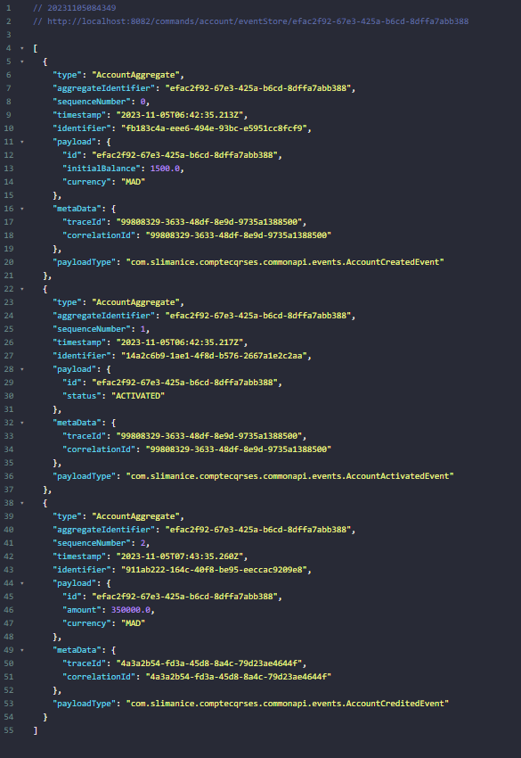
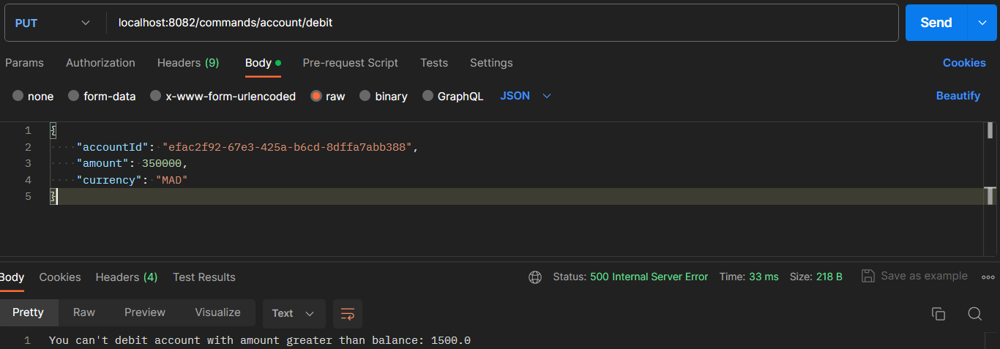
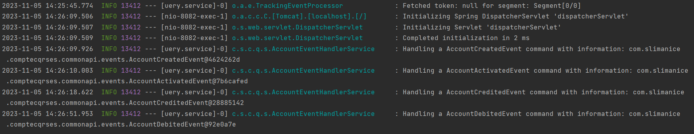
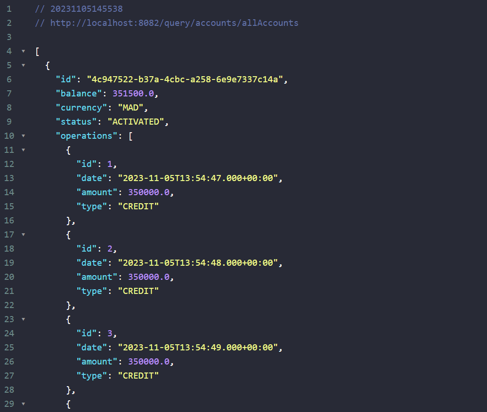

Writing the README.md file

# CQRS Event Sourcing Application with Spring Boot and Axon Framework 🍃

  
## 📝 Table of Contents

- [📖 Overview](#-overview)
- [📦 Dependencies](#-dependencies)
- [🛠️ Project Structure](#-project-structure)
- [🚀 Code Snippets](#-code-snippets)
  - [📁 AccountAggregate Class](#-accountaggregate-class)
  - [📁 AccountCommand Controller](#-accountcommand-controller)
  - [📁 AccountQuery Controller](#-accountquery-controller)
  - [📁 AccountEventHandlerService Class](#-accounthandlerservice-class)
- [✅ Screenshots](#-screenshots)

## 📖 Overview
This is a simple application that demonstrates the use of CQRS and Event Sourcing. The application is a simple REST API that allows you to create a bank account, deposit and withdraw money from it. The application is written in Java using the Spring Boot framework and the Axon Framework library. 

## 📦 Dependencies
     

## 🛠️ Project Structure
```
C:.                                       
├───main                                  
│   ├───java                                                 
│   │   └───com                                              
│   │       └───slimanice                                    
│   │           └───comptecqrses                             
│   │               │   CompteCqrsEsApplication.java         
│   │               │                                        
│   │               ├───commands                             
│   │               │   ├───aggregates                       
│   │               │   │       AccountAggregate.java        
│   │               │   │                                    
│   │               │   └───controllers                      
│   │               │           AccountCommandController.java
│   │               │                                        
│   │               ├───commonapi                            
│   │               │   ├───commands
│   │               │   │       BaseCommand.java
│   │               │   │       CreateAccountCommand.java
│   │               │   │       CreditAccountCommand.java
│   │               │   │       DebitAccountCommand.java
│   │               │   │
│   │               │   ├───dtos
│   │               │   │       CreateAccountRequestDTO.java
│   │               │   │       CreditAccountRequestDTO.java
│   │               │   │       DebitAccountRequestDTO.java
│   │               │   │
│   │               │   ├───enums
│   │               │   │       AccountStatus.java
│   │               │   │       OperationType.java
│   │               │   │
│   │               │   ├───events
│   │               │   │       AccountActivatedEvent.java
│   │               │   │       AccountCreatedEvent.java
│   │               │   │       AccountCreditedEvent.java
│   │               │   │       AccountDebitedEvent.java
│   │               │   │       BaseEvent.java
│   │               │   │
│   │               │   ├───exceptions
│   │               │   │       BalanceNotSufficientException.java
│   │               │   │       NegativeAmountException.java
│   │               │   │
│   │               │   └───queries
│   │               │           GetAccountByIdQuery.java
│   │               │           GetAllAccountsQuery.java
│   │               │
│   │               └───query
│   │                   ├───controllers
│   │                   │       AccountQueryController.java
│   │                   │       
│   │                   ├───entities
│   │                   │       Account.java
│   │                   │       Operation.java
│   │                   │
│   │                   ├───repositories
│   │                   │       AccountRepository.java
│   │                   │       OperationRepository.java
│   │                   │
│   │                   └───service
│   │                           AccountEventHandlerService.java
│   │
│   └───resources
│       │   application.properties
```
### application.properties
* This file contains the configuration of the application. In this file we configure the connection to the database and the configuration of the Axon Framework Serializer.
```properties
spring.application.name=compte-service
spring.datasource.url=jdbc:mysql://${MYSQL_HOST:localhost}:${MYSQL_PORT:3306}/bank?createDatabaseIfNotExist=true
spring.datasource.username=${MYSQL_USER:root}
spring.datasource.password=${MYSQL_PASSWORD:}
spring.jpa.hibernate.ddl-auto=create
spring.jpa.properties.hibernate.dialect=org.hibernate.dialect.MariaDBDialect
server.port=8082
axon.serializer.events=jackson
axon.serializer.messages=xstream
axon.serializer.general=jackson
```

## 🚀 Code Snippets
This section contains some code snippets that are used in the application. The rest of the code can be found in the project.

### 📁 AccountAggregate Class
- The aggregate is the main component of the application. It is the one that will be handling the commands and will be applying the events.
```java
@Aggregate
public class AccountAggregate {
  @AggregateIdentifier
  private String accountId;
  private double balance;
  private String currency;
  private AccountStatus status;

  public AccountAggregate() {
    // Required by AXON
  }

  @CommandHandler
  public AccountAggregate(CreateAccountCommand createAccountCommand) {
    // Required by AXON
    if(createAccountCommand.getInitialBalance() < 0) throw new RuntimeException("You can't create account with negative initial balance");
    AggregateLifecycle.apply(new AccountCreatedEvent(
            createAccountCommand.getId(),
            new Date(),
            createAccountCommand.getInitialBalance(),
            createAccountCommand.getCurrency(),
            AccountStatus.CREATED
    ));
  }

  @EventSourcingHandler
  public void on(AccountCreatedEvent event) {
    this.accountId = event.getId();
    this.balance = event.getInitialBalance();
    this.currency = event.getCurrency();
    this.status = event.getStatus();
    AggregateLifecycle.apply(new AccountActivatedEvent(
            event.getId(),
            new Date(),
            AccountStatus.ACTIVATED
    ));
  }

  @EventSourcingHandler
  public void on(AccountActivatedEvent event) {
    this.status = event.getStatus();
  }

  @CommandHandler
  public void handle(CreditAccountCommand command) {
    if(command.getAmount() < 0) throw new NegativeAmountException("You can't credit account with negative amount");

    AggregateLifecycle.apply(new AccountCreditedEvent(
            command.getId(),
            new Date(),
            command.getAmount(),
            command.getCurrency()
    ));
  }

  @EventSourcingHandler
  public void on(AccountCreditedEvent event) {
    this.balance += event.getAmount();
  }

  @CommandHandler
  public void handle(DebitAccountCommand command) {
    if(command.getAmount() < 0) throw new NegativeAmountException("You can't debit account with negative amount");
    if(command.getAmount() > this.balance) throw new BalanceNotSufficientException("You can't debit account with amount greater than balance: " + this.balance);

    AggregateLifecycle.apply(new AccountDebitedEvent(
            command.getId(),
            new Date(),
            command.getAmount(),
            command.getCurrency()
    ));
  }

  @EventSourcingHandler
  public void on(AccountDebitedEvent event) {
    this.balance -= event.getAmount();
  }
}
```

### 📁 AccountCommand Controller
- The controller will be handling the HTTP requests and will be sending the commands to the command gateway. 
```java
@RestController
@RequestMapping(path = "/commands/account")
@AllArgsConstructor
public class AccountCommandController {
  private final CommandGateway commandGateway;
  private final EventStore eventStore;

  @PostMapping(path = "/create")
  public CompletableFuture<String> createAccount(@RequestBody CreateAccountRequestDTO request) {
    CompletableFuture<String> commandResponse = commandGateway.send(new CreateAccountCommand(
            UUID.randomUUID().toString(),
            request.getInitialBalance(),
            request.getCurrency()
    ));

    return commandResponse;
  }

  @PutMapping(path = "/credit")
  public CompletableFuture<String> creditAccount(@RequestBody CreditAccountRequestDTO request) {
    CompletableFuture<String> commandResponse = commandGateway.send(new CreditAccountCommand(
            request.getAccountId(),
            request.getAmount(),
            request.getCurrency()
    ));

    return commandResponse;
  }

  @PutMapping(path = "/debit")
  public CompletableFuture<String> debitAccount(@RequestBody DebitAccountRequestDTO request) {
    CompletableFuture<String> commandResponse = commandGateway.send(new DebitAccountCommand(
            request.getAccountId(),
            request.getAmount(),
            request.getCurrency()
    ));

    return commandResponse;
  }

  @ExceptionHandler(Exception.class)
  public ResponseEntity<String> exceptionHandler(Exception exception) {
    ResponseEntity<String> entity = new ResponseEntity<>(
            exception.getMessage(),
            HttpStatus.INTERNAL_SERVER_ERROR
    );
    return entity;
  }

  // Fetching event from event store by account id
  @GetMapping(path = "/eventStore/{accountId}")
  public Stream eventStore(@PathVariable String accountId) {
    return eventStore.readEvents(accountId).asStream();
  }
}
```

### 📁 AccountQueryController Class
- The controller will be handling the HTTP requests and will be sending the queries to the query gateway. 
```java
@RestController
@RequestMapping("/query/accounts")
@AllArgsConstructor
@Slf4j
public class AccountQueryController {
    private QueryGateway queryGateway;

    @GetMapping("/allAccounts")
    public List<Account> accounts() {
        log.info("Handling a AccountCreatedEvent command with information:");
        return queryGateway.query(new GetAllAccountsQuery(), ResponseTypes.multipleInstancesOf(Account.class)).join();
    }

    @GetMapping("byId/{id}")
    public Account accountById(@PathVariable String id) {
        log.info("Handling a AccountCreatedEvent command with information:");
        return queryGateway.query(new GetAccountByIdQuery(id), ResponseTypes.instanceOf(Account.class)).join();
    }
}

```

### 📁 AccountEventHandlerService Class
- The event handler service will be handling the events and will be saving them in the database.
```java
@Service
@AllArgsConstructor
@Slf4j
@Transactional
public class AccountEventHandlerService {
  private AccountRepository accountRepository;
  private OperationRepository operationRepository;

  @EventHandler
  public void on(AccountCreatedEvent event){
    log.info("Handling a AccountCreatedEvent command with information: {}", event);
    Account account = new Account();
    account.setId(event.getId());
    account.setCurrency(event.getCurrency());
    account.setStatus(event.getStatus());
    account.setBalance(event.getInitialBalance());
    accountRepository.save(account);
  }

  @EventHandler
  public void on(AccountCreditedEvent event){
    log.info("Handling a AccountCreditedEvent command with information: {}", event);
    Account account = accountRepository.findById(event.getId()).get();
    Operation operation = new Operation();
    operation.setAccount(account);
    operation.setAmount(event.getAmount());
    operation.setDate(event.getDate());
    operation.setType(OperationType.CREDIT);
    operationRepository.save(operation);
    account.setBalance(account.getBalance() + event.getAmount());
    accountRepository.save(account);
  }

  @EventHandler
  public void on(AccountActivatedEvent event){
    log.info("Handling a AccountActivatedEvent command with information: {}", event);
    Account account = accountRepository.findById(event.getId()).get();
    account.setStatus(event.getStatus());
    accountRepository.save(account);
  }

  @EventHandler
  public void on(AccountDebitedEvent event){
    log.info("Handling a AccountDebitedEvent command with information: {}", event);
    Account account = accountRepository.findById(event.getId()).get();
    Operation operation = new Operation();
    operation.setAccount(account);
    operation.setAmount(event.getAmount());
    operation.setDate(event.getDate());
    operation.setType(OperationType.DEBIT);
    operationRepository.save(operation);
    account.setBalance(account.getBalance() - event.getAmount());
    accountRepository.save(account);
  }

  @QueryHandler
  public List<Account> on(GetAllAccountsQuery query){
    log.info("Handling a GetAllAccountsQuery command with information: {}", query);
    return accountRepository.findAll();
  }

  @QueryHandler
  public Account on(GetAccountByIdQuery query){
    log.info("Handling a GetAccountByIdQuery command with information: {}", query);
    return accountRepository.findById(query.getId()).get();
  }
}
```

## ✅ Screenshots
1. Testing the creation of an account



2. Testing the creation of an account with negative initial balance



3. Created events in MySQL database



4. Fetching event from event store



5. Testing the credit of an account



6. Testing the debit of an account with insufficient balance


7. Testing the querying service (Creating an account , crediting it and debiting it)


7. Testing the query REST Controller
